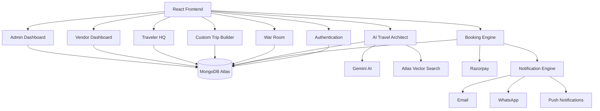
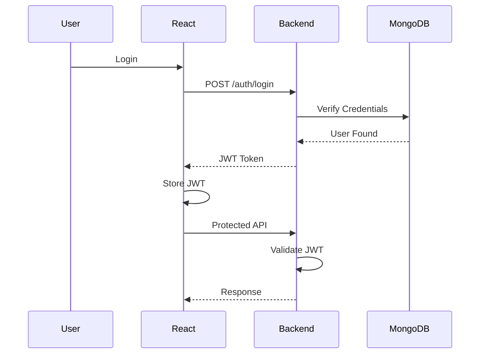
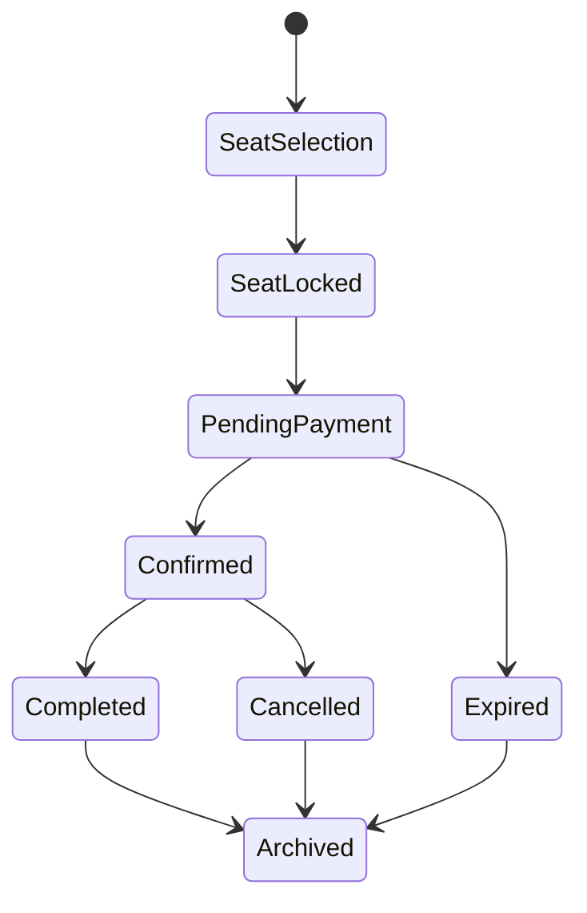
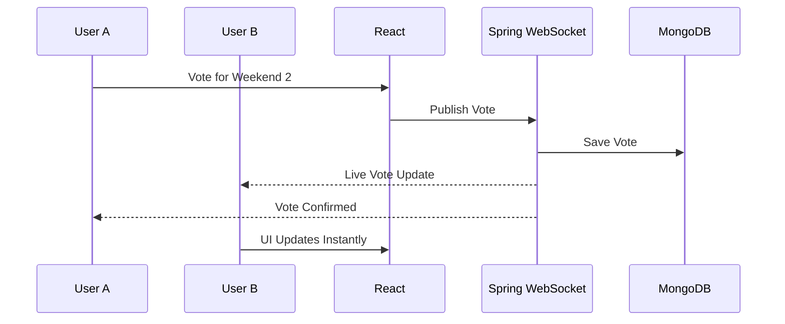

# WanderSync
# Complete System Architecture

---

# 1. High Level Architecture

WanderSync follows a Modular Monolith Architecture.

Instead of dozens of microservices, the application is divided into independent modules inside one Spring Boot application.

This gives us

- Faster development
- Easier debugging
- Simpler deployment
- Production-ready architecture
- Ability to migrate to microservices in the future

---

                +-----------------------------------+
                |          React Frontend           |
                |-----------------------------------|
                | Landing Page                      |
                | Authentication                    |
                | AI Planner                        |
                | Trip Search                       |
                | Custom Package Builder            |
                | Booking                           |
                | War Room                          |
                | Vendor Dashboard                  |
                | Admin Dashboard                   |
                | Traveler HQ                       |
                +-----------------+-----------------+
                                  |
                           REST APIs
                                  |
                     JWT Authentication
                                  |
               WebSocket (STOMP + SockJS)
                                  |
        +-------------------------+--------------------------+
        |                   Spring Boot                      |
        +----------------------------------------------------+
        | Authentication Module                              |
        | Booking Module                                     |
        | Pricing Engine                                     |
        | AI Module                                          |
        | Vendor Module                                      |
        | Admin Module                                       |
        | Traveler Module                                    |
        | Notification Module                                |
        | Payment Module                                     |
        | War Room Module                                    |
        | Analytics Module                                   |
        +----------------------------------------------------+
                                  |
                        MongoDB Atlas Database
                                  |
          +---------------------------------------------+
          | Users                                       |
          | Trips                                       |
          | Bookings                                    |
          | Payments                                    |
          | Knowledge Base                              |
          | War Rooms                                   |
          | Notifications                               |
          | Wallet                                      |
          | Traveler Stats                              |
          | Future Trips                                |
          | Catalog Options                             |
          +---------------------------------------------+

---

# 2. Architecture Principles

The project follows

- Modular Monolith
- Clean Architecture
- Layered Architecture
- SOLID Principles
- Dependency Injection
- Event Driven Notifications
- Repository Pattern
- DTO Pattern
- Strategy Pattern
- Builder Pattern
- Factory Pattern (Future)
- Observer Pattern (Spring Events)

---

# 3. Backend Modules

## Authentication Module

Responsibilities

- Register
- Login
- JWT
- Role Management
- Refresh Tokens (Future)

Roles

- ADMIN
- VENDOR
- TRAVELER

---

## Trip Module

Responsibilities

Trip CRUD

Vendor Trips

Trip Search

Seat Maps

Availability

Dynamic Pricing

---

## Booking Module

Responsibilities

Seat Lock

Booking Creation

Booking Confirmation

Booking Cancellation

Booking History

Refund

Invoice

---

## Pricing Engine

Responsible for

Base Price

Dynamic Pricing

Discounts

Coupons

Taxes

Platform Fee

Add-ons

Final Price

---

## AI Module

Responsible for

RAG

Gemini

Vector Search

Embeddings

Prompt Engineering

Structured Output

Travel Recommendations

Custom Itinerary

---

## Vendor Module

Trip Creation

Trip Update

Pricing

Bookings

Revenue

Analytics

Occupancy

---

## Admin Module

User Management

Vendor Approval

Demand Dashboard

Analytics

Future Trips

Knowledge Base

Platform Management

---

## Traveler Module

Traveler Dashboard

Travel Stats

Badges

Wallet

Travel Squad

Memory Vault

Profile

---

## War Room Module

Live Members

Voting

Chat

Split Payments

Trip Planning

Invite Links

---

## Payment Module

Razorpay

Webhook Verification

Payment Status

Refund

Split Payments

Invoices

---

## Notification Module

Emails

WhatsApp

Push Notifications

Reminders

Event Listeners

---

## Analytics Module

Revenue

Bookings

Popular Destinations

Vendor Analytics

Traveler Analytics

Demand Analytics

---

# 4. Frontend Modules

Landing

Authentication

Search

Trip Details

Booking

Checkout

AI Planner

Future Trips

Custom Package Builder

War Room

Traveler HQ

Vendor Dashboard

Admin Dashboard

Settings

Profile

Wallet

Notifications

---

# 5. AI Architecture

User Prompt

↓

Prompt Processing

↓

Embedding Search

↓

MongoDB Atlas Vector Search

↓

Top Documents

↓

Gemini

↓

Structured JSON

↓

Frontend Cards

---

Fallback

If Gemini fails

↓

Return curated travel data

↓

Never show AI errors

---

# 6. Booking Flow

Search Trip

↓

Open Details

↓

Select Seats

↓

Seat Lock

↓

Price Calculation

↓

Payment

↓

Webhook

↓

Booking Confirmed

↓

Invoice

↓

Email

↓

Traveler Dashboard

---

# 7. War Room Flow

Host Creates Lobby

↓

Invite Friends

↓

Members Join

↓

Voting

↓

Trip Selection

↓

Split Payment

↓

Everyone Pays

↓

Booking Confirmed

---

# 8. Future Destination Flow

Admin Creates Teaser

↓

Users Vote

↓

Demand Analytics

↓

Threshold Crossed

↓

Admin Converts

↓

Trip Published

---

# 9. Custom Package Flow

Destination

↓

Filters

↓

Transport

↓

Hotels

↓

Activities

↓

Meals

↓

Add-ons

↓

Live Pricing

↓

Save Quote

↓

Book

---

# 10. AI Planning Flow

Prompt

↓

Destination Detection

↓

Budget Analysis

↓

Traveler Type

↓

RAG Search

↓

Gemini

↓

JSON

↓

Frontend Timeline

---

# 11. Notification Flow

Booking Confirmed

↓

Spring Event

↓

Notification Service

↓

Email

↓

WhatsApp

↓

Push Notification

↓

Notification Log

---

# 12. Deployment

Frontend

↓

Vercel

Backend

↓

Render

Database

↓

MongoDB Atlas

Images

↓

Cloudinary

AI

↓

Google Gemini

Payments

↓

Razorpay

Email

↓

Resend

Monitoring

↓

UptimeRobot

---

# 13. Security

JWT

Password Encryption

Role Based Access

Rate Limiting

Webhook Verification

Input Validation

Optimistic Locking

CORS

HTTPS

---

# 14. Future Scalability

Move Booking Module

↓

Microservice

Move AI Module

↓

Separate Service

Move Notification

↓

Separate Worker

Move Payments

↓

Dedicated Payment Service

Everything can scale independently in the future.


# WanderSync System Architecture

Version: 1.0

---

# 1. Introduction

## Overview

WanderSync is an AI-powered experiential travel platform designed to simplify trip discovery, planning, booking, collaboration, and post-trip engagement.

Unlike traditional Online Travel Agencies (OTAs), WanderSync focuses on complete travel lifecycle management.

The platform combines:

- AI Trip Planning
- Custom Package Builder
- Group Trip Collaboration
- Split Payments
- Vendor Management
- Real-Time Notifications
- Traveler Gamification
- AI Recommendation Engine

---

# 2. Architecture Goals

The architecture has been designed with the following principles.

- Scalability
- Security
- Maintainability
- High Availability
- Modular Design
- Event Driven Communication
- AI Ready
- Cloud Native
- Mobile Friendly

---

# 3. High Level Architecture

```

                    React Frontend
                           │
          REST APIs + WebSocket (JWT)
                           │
                   Spring Boot Backend
                           │
 ┌───────────────────────────────────────────────────┐
 │                                                   │
 │ Authentication Module                             │
 │ Booking Engine                                    │
 │ War Room Engine                                   │
 │ AI Travel Architect                               │
 │ Custom Trip Builder                               │
 │ Vendor Module                                     │
 │ Notification Engine                               │
 │ Payment Engine                                    │
 │ Traveler HQ                                       │
 │ Admin Dashboard                                   │
 │ Analytics Engine                                  │
 │                                                   │
 └───────────────────────────────────────────────────┘
                           │
                  MongoDB Atlas Database
                           │
            Atlas Vector Search + Embeddings
                           │
          Gemini AI + External Integrations

```

---

# 4. Major Modules

## Authentication

Responsible for

- Registration
- Login
- JWT Authentication
- Authorization
- RBAC
- Refresh Tokens

---

## Booking Engine

Responsible for

- Seat Locking
- Booking
- Dynamic Pricing
- Cancellation
- Ticket Generation
- Booking History

---

## AI Travel Architect

Responsible for

- Natural Language Planning
- Destination Recommendation
- RAG
- Itinerary Generation
- Budget Optimization
- Personalized Suggestions

---

## War Room

Responsible for

- Group Planning
- Live Voting
- Shared Decisions
- Split Payments
- Collaboration

---

## Vendor Platform

Responsible for

- Trip Management
- Inventory
- Pricing
- Occupancy
- Revenue Dashboard

---

## Traveler HQ

Responsible for

- Statistics
- Wallet
- Badges
- Memories
- Saved Companions
- Referral System

---

## Notification Engine

Responsible for

- Email
- WhatsApp
- Push Notifications
- SMS
- In-App Notifications

---

## Analytics Engine

Responsible for

- Business Reports
- Revenue
- Demand Analysis
- User Behaviour
- Conversion Funnel

---

# 5. External Integrations

The system integrates with multiple third-party services.

| Service | Purpose |
|----------|----------|
| Gemini AI | AI Trip Planning |
| MongoDB Atlas | Database & Vector Search |
| Razorpay | Payments |
| Cloudinary | Image Storage |
| Resend / SendGrid | Email |
| Twilio / Meta WhatsApp | WhatsApp Notifications |
| OpenWeather API | Weather Forecast |
| Google Maps API | Maps & Distance |
| Firebase FCM | Push Notifications |

---

# 6. Technology Stack

Frontend

- React
- Vite
- Tailwind CSS
- React Router
- Axios
- SockJS
- STOMP

Backend

- Java 21
- Spring Boot
- Spring Security
- Spring Data MongoDB
- Spring AI
- Spring WebSocket

Database

- MongoDB Atlas
- Atlas Vector Search

DevOps

- Docker
- GitHub
- GitHub Actions

---

# 7. Architecture Principles

The application follows

- Modular Monolith
- Clean Architecture
- Repository Pattern
- Service Layer Pattern
- Event Driven Design
- Dependency Injection
- SOLID Principles

---

# 8. Communication Flow

Frontend

↓

REST API

↓

Controller

↓

Service

↓

Repository

↓

MongoDB

↓

Response


---

# 9. Module Interaction Diagram

The following diagram illustrates how different modules inside WanderSync communicate with one another.



---

# 10. Request Lifecycle

Every request in WanderSync follows the same standardized flow.

```mermaid
flowchart LR

User

-->

React Frontend

-->

Axios API Call

-->

Spring Controller

-->

Service Layer

-->

Repository Layer

-->

MongoDB

-->

Repository

-->

Service

-->

Controller

-->

JSON Response

-->

React UI Update

```

---

## Why this architecture?

This layered architecture ensures:

- Controllers remain lightweight.
- Business logic is isolated inside Services.
- Database access stays inside Repositories.
- The frontend never communicates directly with MongoDB.
- Future maintenance becomes significantly easier.

---

# 11. Authentication Flow

Authentication is based on JWT with Role-Based Access Control (RBAC).



---

## User Roles

Three primary roles exist within the platform.

| Role | Responsibilities |
|-------|------------------|
| Traveler | Browse, Book Trips, AI Planner, War Room |
| Vendor | Manage Trips, Inventory, Pricing |
| Admin | Platform Administration, Analytics, User Management |

---

# 12. Booking Lifecycle

The booking engine follows a strict state machine.



---

## Booking States

| State | Description |
|--------|-------------|
| Seat Locked | Seats temporarily reserved |
| Pending Payment | Waiting for payment |
| Confirmed | Booking successful |
| Cancelled | User cancelled |
| Expired | Lock timed out |
| Completed | Trip finished |
| Archived | Historical record |

---

# 13. AI Request Flow

The AI Travel Architect uses Retrieval-Augmented Generation (RAG).

```mermaid
flowchart TD

User Prompt

-->

React

-->

Backend

-->

Vector Search

-->

Relevant Documents

-->

Gemini AI

-->

Structured JSON

-->

Backend Validation

-->

React

```

---

## AI Pipeline

1. User enters a travel prompt.
2. Backend generates an embedding.
3. Atlas Vector Search retrieves relevant travel knowledge.
4. Gemini receives both the prompt and retrieved context.
5. Gemini returns a structured itinerary.
6. Backend validates the response.
7. The frontend displays the itinerary.

This architecture significantly reduces hallucinations by grounding AI responses in verified travel knowledge.


---

# 14. War Room WebSocket Architecture

The War Room enables real-time collaboration between travelers without requiring page refreshes.

All communication is handled through WebSockets using STOMP over SockJS.



---

## Real-Time Events

The following events are broadcast instantly to all connected members.

- Member Joined
- Member Left
- Poll Created
- Poll Closed
- Vote Submitted
- Itinerary Updated
- Split Payment Completed
- Chat Message
- Booking Locked
- AI Recommendation Generated

---

# 15. Split Payment Flow

One of WanderSync's core differentiators is collaborative payment.

```mermaid
flowchart TD

Booking Locked

-->

Generate Individual Payment Links

-->

Razorpay

-->

Member Payments

-->

Webhook Verification

-->

Update Payment Status

-->

Everyone Paid?

Yes --> Booking Confirmed

No --> Wait For Remaining Members

Timeout --> Cancel Booking

```

---

## Payment Principles

- Backend is the source of truth.
- Client never confirms payments.
- Razorpay Webhooks finalize payment status.
- Duplicate webhooks are ignored using idempotency keys.
- Automatic refunds are initiated if the booking expires.

---

# 16. Event-Driven Notification Architecture

Instead of tightly coupling services, WanderSync uses internal events.

```mermaid
flowchart LR

Booking Confirmed

-->

Spring Event

-->

Notification Service

Notification Service --> Email

Notification Service --> WhatsApp

Notification Service --> Push Notification

Notification Service --> In-App Notification

Notification Service --> Update Traveler Stats

Notification Service --> Reward WanderCoins

```

---

## Why Event-Driven?

Benefits include:

- Faster API responses
- Better scalability
- Loose coupling
- Easier maintenance
- Independent feature expansion

---

# 17. Deployment Architecture

WanderSync follows a cloud-ready deployment architecture.

```mermaid
graph TD

Developer

-->

GitHub

-->

GitHub Actions

-->

Docker Build

-->

Cloud Server

Cloud Server --> Spring Boot

Spring Boot --> MongoDB Atlas

Spring Boot --> Gemini AI

Spring Boot --> Razorpay

Spring Boot --> Cloudinary

Spring Boot --> Firebase

Spring Boot --> Twilio

```

---

## Deployment Components

| Component | Purpose |
|-----------|----------|
| GitHub | Source Control |
| GitHub Actions | CI/CD |
| Docker | Containerization |
| Spring Boot | Backend |
| React | Frontend |
| MongoDB Atlas | Database |
| Cloudinary | Media Storage |
| Razorpay | Payments |
| Gemini AI | AI Services |

---

# 18. Security Architecture

Security is enforced at multiple layers.

```mermaid
graph LR

Internet

-->

HTTPS

-->

Spring Security

-->

JWT Authentication

-->

Role Based Authorization

-->

Business Validation

-->

MongoDB

```

---

## Security Layers

### Transport Security

- HTTPS
- Secure Headers
- CORS Configuration

---

### Authentication

- JWT Tokens
- Password Encryption (BCrypt)
- Refresh Tokens
- Sessionless Authentication

---

### Authorization

- Role-Based Access Control
- Method-Level Security
- Resource Ownership Validation

---

### API Protection

- Request Validation
- Rate Limiting
- Login Attempt Tracking
- Input Sanitization

---

### Database Security

- MongoDB Authentication
- Least Privilege Access
- Indexed Queries
- Audit Logging

---

# 19. Scalability Strategy

The platform is initially designed as a Modular Monolith.

As traffic grows, individual modules can be extracted into independent microservices.

```mermaid
graph TD

Modular Monolith

-->

Booking Service

-->

AI Service

-->

Notification Service

-->

Payment Service

-->

Analytics Service

```

---

## Scaling Approach

### Phase 1

Single Spring Boot application.

Suitable for:

- MVP
- College Project
- Startup Validation

---

### Phase 2

Horizontal scaling.

- Multiple backend instances
- Load Balancer
- Redis (optional)
- CDN

---

### Phase 3

Selective microservice extraction.

Potential candidates:

- AI Engine
- Notification Engine
- Analytics Engine
- Payment Service

---

# 20. End-to-End User Journey

```mermaid
flowchart LR

Landing Page

-->

AI Search

-->

Destination Recommendation

-->

Trip Details

-->

War Room

-->

Voting

-->

Custom Package

-->

Booking

-->

Payment

-->

Notifications

-->

Travel

-->

Memories

-->

Traveler HQ

-->

Referral

-->

Next Trip

```

---

# 21. Architecture Summary

WanderSync is designed as an AI-powered experiential travel platform that manages the complete traveler lifecycle.

Unlike traditional travel applications that focus only on bookings, WanderSync integrates:

- AI-powered trip planning
- Collaborative War Rooms
- Split payments
- Custom package building
- Real-time notifications
- Vendor management
- Traveler gamification
- Wallet and referral system
- AI-driven recommendations
- Event-driven architecture

The platform is designed to be scalable, secure, modular, and cloud-ready while remaining suitable for rapid startup development.

This architecture allows WanderSync to evolve from a college project into a production-grade travel ecosystem with minimal architectural changes.

