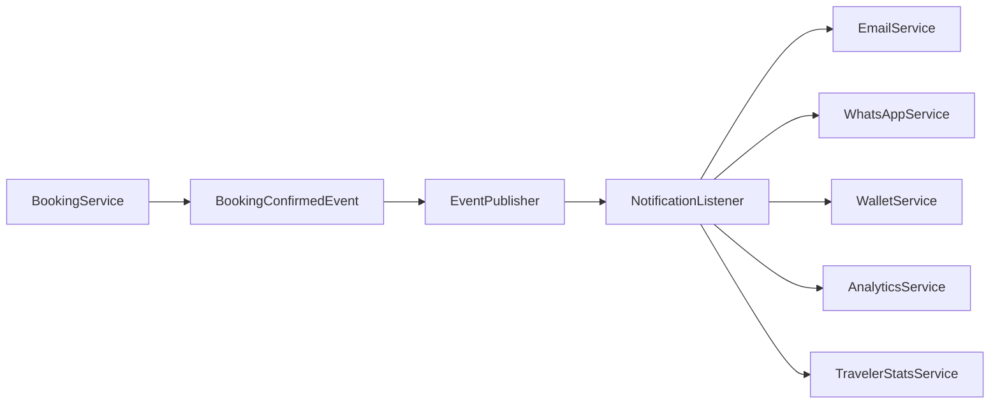
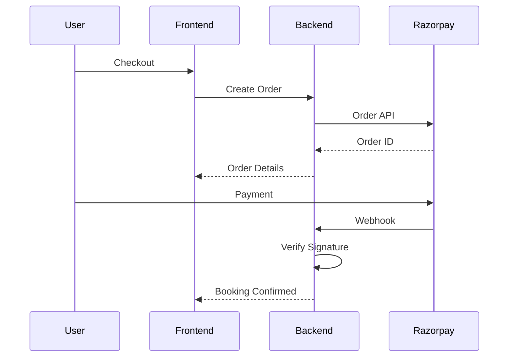

# WanderSync Backend Architecture

Version: 1.0

---

# 1. Introduction

## Overview

The WanderSync backend is built using Java 21 and Spring Boot 3.x following a Modular Monolith architecture.

The application is organized into independent feature modules while remaining a single deployable application.

This approach provides:

- Faster Development
- Easier Maintenance
- Better Testing
- Simpler Deployment
- Future Microservice Readiness

---

# 2. Backend Technology Stack

| Technology | Purpose |
|------------|----------|
| Java 21 | Programming Language |
| Spring Boot | Backend Framework |
| Spring Security | Authentication & Authorization |
| Spring Data MongoDB | Database Access |
| Spring AI | AI Integration |
| Spring WebSocket | War Room |
| JWT | Authentication |
| MongoDB Atlas | Database |
| Atlas Vector Search | AI Knowledge Base |
| Razorpay | Payments |
| Cloudinary | Image Storage |
| Docker | Deployment |

---

# 3. Backend Folder Structure

```text

src/main/java/com/wandersync

├── config
├── security
├── auth
├── users
├── bookings
├── trips
├── destinations
├── vendors
├── payments
├── ai
├── notifications
├── warroom
├── travelerhq
├── wallet
├── referrals
├── analytics
├── common
├── exceptions
└── utils

```

---

# 4. Layered Architecture

Every module follows exactly the same structure.

```text

module

│

├── controller

├── service

├── repository

├── dto

├── entity

├── mapper

├── validation

└── event

```

---

# 5. Why Layered Architecture?

Each layer has a single responsibility.


Each layer has one responsibility.

| Layer | Responsibility |
|--------|----------------|
| Controller | Accept HTTP requests and return responses |
| Service | Business Logic |
| Repository | Database Access |
| DTO | Request and Response Models |
| Entity | MongoDB Documents |
| Mapper | Entity ↔ DTO Conversion |
| Validation | Input Validation |
| Event | Domain Events |

Business logic must never exist inside Controllers.

Repositories should never contain business logic.

---

# 6. Feature Modules

The backend is divided into independent modules.

## Authentication

Responsibilities

- User Registration
- Login
- JWT
- Refresh Token
- RBAC
- Password Reset
- Email Verification

---

## User Module

Responsibilities

- Profile
- Preferences
- Saved Companions
- Account Settings

---

## Trip Module

Responsibilities

- Planned Trips
- Future Teaser Trips
- Trip Search
- Categories
- Availability

---

## Booking Module

Responsibilities

- Seat Lock
- Booking
- Booking History
- Ticket Generation
- Cancellation
- Price Calculation

---

## Payment Module

Responsibilities

- Razorpay Orders
- Payment Verification
- Refunds
- Split Payments
- Payment Webhooks

---

## AI Module

Responsibilities

- AI Planner
- RAG
- Embeddings
- Prompt Templates
- Itinerary Generation
- AI Feedback

---

## War Room Module

Responsibilities

- Room Management
- Live Collaboration
- Polls
- Votes
- Chat
- Split Payments

---

## Notification Module

Responsibilities

- Email
- WhatsApp
- Push Notifications
- SMS
- Event Listeners

---

## Traveler HQ

Responsibilities

- Wallet
- Badges
- XP
- Memories
- Dashboard
- Statistics

---

## Vendor Module

Responsibilities

- Vendor Management
- Trip Inventory
- Pricing
- Occupancy
- Revenue Dashboard

---

## Analytics Module

Responsibilities

- Reports
- Dashboards
- Demand Forecast
- User Analytics
- Revenue

---

# 7. Request Processing Pipeline

Every request follows the same pipeline.

```mermaid
flowchart LR

Client

-->

Controller

-->

Validation

-->

Service

-->

Repository

-->

MongoDB

-->

Repository

-->

Service

-->

DTO Mapper

-->

Controller

-->

Client

```

---

## Why this Pipeline?

Benefits

- Easy debugging
- Consistent codebase
- Better testing
- Clean architecture
- Reusable logic

---

# 8. DTO Strategy

The backend never exposes database entities directly.

Instead:

Client

↓

DTO

↓

Mapper

↓

Entity

↓

MongoDB

Reasons

- Security
- Validation
- Versioning
- Better API Design

---

## Example DTOs

Authentication

- LoginRequest
- RegisterRequest
- LoginResponse

Booking

- BookingRequest
- BookingResponse
- PriceQuoteResponse

AI

- AITripRequest
- AITripResponse

War Room

- CreateRoomRequest
- PollResponse

Vendor

- TripCreateRequest
- TripUpdateRequest

---

# 9. Validation Strategy

Validation happens before business logic executes.

Examples

User Registration

- Email Required
- Password Strength
- Mobile Validation

Booking

- Seat Availability
- Booking Window
- Traveler Count

Payment

- Amount Validation
- Booking Exists
- Payment Status

AI

- Prompt Length
- Budget Limits
- Date Validation

Validation failures return standardized error responses.

---

# 10. Exception Handling

A centralized GlobalExceptionHandler handles every exception.

Categories

Authentication

Authorization

Validation

Booking

Payment

AI

Vendor

Database

Unexpected Errors

---

## Standard Error Response

```json
{
  "timestamp":"2026-08-01T10:30:15",
  "status":400,
  "error":"Validation Failed",
  "message":"Email is required",
  "path":"/api/auth/register"
}
```

---

# 11. Repository Layer

Repositories only perform CRUD operations.

Examples

UserRepository

BookingRepository

TripRepository

PaymentRepository

VendorRepository

NotificationRepository

WalletRepository

Repositories must not contain business logic.

Complex logic belongs inside Services.

---

# 12. Service Layer

The Service Layer is the heart of the backend.

Responsibilities

- Business Rules
- Transactions
- Domain Validation
- Event Publishing
- External API Calls

Services communicate with each other through interfaces whenever possible.

This improves testing and future microservice migration.


---

# 13. Event-Driven Architecture

WanderSync follows an event-driven approach for operations that should not block the user's request.

Instead of tightly coupling modules together, important business events are published and handled asynchronously.



---

## Core Events

The system publishes events for important business actions.

| Event | Trigger |
|--------|----------|
| UserRegisteredEvent | New user registration |
| BookingCreatedEvent | Booking initiated |
| BookingConfirmedEvent | Payment completed |
| BookingCancelledEvent | Booking cancelled |
| PaymentCapturedEvent | Razorpay webhook verified |
| WarRoomCreatedEvent | New War Room |
| MemberJoinedEvent | Traveler joins War Room |
| PollCreatedEvent | New poll |
| VoteSubmittedEvent | Member votes |
| AIItineraryGeneratedEvent | AI finishes itinerary |
| ReferralRewardEvent | Referral successful |

---

## Benefits

- Faster APIs
- Loose Coupling
- Easy Feature Expansion
- Better Maintainability
- Independent Background Processing

---

# 14. WebSocket Architecture

The War Room module uses WebSockets for live collaboration.

Communication protocol:

SockJS

↓

STOMP

↓

Spring WebSocket

↓

Broker

↓

Connected Clients

---

## Real-Time Events

The backend broadcasts:

- Member Joined
- Member Left
- Seat Locked
- Seat Released
- Poll Created
- Vote Submitted
- Payment Completed
- AI Recommendation Ready
- Chat Message
- Booking Confirmed

---

## Topic Structure

| Topic | Purpose |
|--------|----------|
| /topic/warroom/{roomId} | Room Updates |
| /topic/polls/{roomId} | Poll Events |
| /topic/chat/{roomId} | Messages |
| /topic/payments/{roomId} | Payment Status |
| /topic/seats/{tripId} | Live Seat Updates |

---

# 15. AI Module Design

The AI module is responsible for intelligent trip planning.

```mermaid
flowchart TD

User Prompt

-->

Prompt Validator

-->

Embedding Generator

-->

Atlas Vector Search

-->

Context Builder

-->

Gemini AI

-->

Structured JSON Parser

-->

Validation

-->

Client Response

```

---

## AI Components

| Component | Responsibility |
|------------|----------------|
| PromptService | Prompt Construction |
| EmbeddingService | Generate Embeddings |
| VectorSearchService | Retrieve Context |
| AIPlannerService | Gemini Integration |
| ItineraryService | Generate Structured Plans |
| AIFeedbackService | Collect Ratings |

---

## AI Principles

- Never trust AI output directly.
- Always validate structured JSON.
- Always use RAG before generation.
- Cache common prompts.
- Log AI latency and token usage.

---

# 16. Payment Architecture

Payments are handled using Razorpay.



---

## Payment Principles

- Backend owns payment state.
- Client never marks payment successful.
- Webhooks are the source of truth.
- Duplicate webhooks are ignored.
- Refunds are fully auditable.

---

# 17. Security Configuration

Authentication uses JWT with Spring Security.

Security components include:

- JWT Authentication Filter
- JWT Utility
- Authentication Provider
- BCrypt Password Encoder
- Role-Based Access Control
- Method-Level Security
- Request Authorization Rules

---

## Endpoint Protection

| Endpoint | Access |
|-----------|--------|
| /auth/** | Public |
| /trips | Public |
| /bookings/** | Traveler |
| /vendor/** | Vendor |
| /admin/** | Admin |
| /ai/** | Authenticated Users |
| /warroom/** | Authenticated Users |

---

# 18. Configuration Management

Application configuration is environment-based.

Profiles

- Development
- Testing
- Production

Configuration includes:

- MongoDB
- Gemini API
- Razorpay
- Cloudinary
- JWT Secrets
- Email Provider
- WhatsApp Provider
- Logging

Sensitive values are stored as environment variables.

---

# 19. Logging & Monitoring

Logging follows structured logging practices.

Levels

- INFO
- DEBUG
- WARN
- ERROR

Critical operations logged:

- Login Attempts
- Payment Events
- Booking Changes
- AI Requests
- Vendor Updates
- Admin Actions

Future integrations:

- Grafana
- Prometheus
- ELK Stack

---

# 20. Background Jobs

Scheduled jobs perform automatic maintenance.

Examples:

- Expire Seat Locks
- Expire Pending Bookings
- Send Trip Reminders
- Award Loyalty Points
- Archive Old Notifications
- Clean Temporary Files
- Refresh Analytics

Spring Scheduler handles recurring jobs.

---

# 21. File Storage Strategy

Media files are stored outside the backend.

Storage providers:

- Cloudinary
- AWS S3 (Future)

Backend stores only:

- File URL
- Metadata
- Owner
- Upload Date

Advantages:

- Reduced server load
- CDN support
- Better scalability

---

# 22. Package Naming Standards

Package names follow feature-based organization.

Example

com.wandersync.booking

com.wandersync.booking.controller

com.wandersync.booking.service

com.wandersync.booking.repository

com.wandersync.booking.dto

com.wandersync.booking.entity

Avoid utility packages containing unrelated classes.

---

# 23. Coding Standards

General Guidelines

- Constructor Injection
- No Field Injection
- Interface-driven Services
- Immutable DTOs
- Meaningful Method Names
- Java Records where applicable
- No Business Logic in Controllers
- No Database Calls in Controllers
- Small, focused Services

---

# 24. Future Microservice Readiness

Although WanderSync starts as a Modular Monolith, each module can be extracted independently.

Likely extraction order:

1. AI Service
2. Notification Service
3. Payment Service
4. Analytics Service
5. Vendor Service

Each module communicates through interfaces and events, minimizing coupling.

---

# 25. Backend Architecture Summary

The backend architecture emphasizes modularity, scalability, and maintainability.

Core design principles include:

- Modular Monolith
- Layered Architecture
- Event-Driven Design
- JWT Security
- Clean Separation of Concerns
- RAG-Based AI
- WebSocket Collaboration
- Externalized Configuration
- Cloud-Ready Deployment

This architecture provides a strong foundation for evolving WanderSync into a production-grade travel platform while remaining manageable for a student team.

